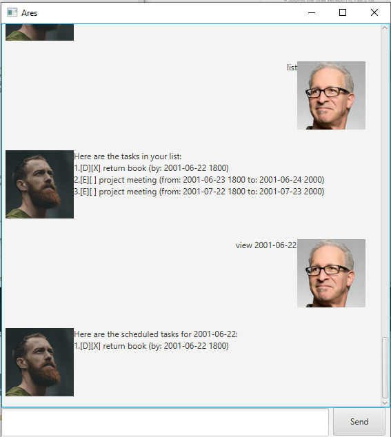

# Ares User Guide

Ares is a **Personal Assistant Chatbot** that helps you keep track of and organize your day-to-day tasks. This User Guide will explain to you how to effectively use the Ares chatbot.

1. [Features](#features)
   - [Adding a task:](#adding-a-task-todo-deadline-event) `todo` `deadline` `event`
   - [Deleting a task:](#deleting-a-task-delete) `delete`
   - [Exiting the Chatbot:](#exiting-the-chatbot-bye) `bye`
   - [Finding a task:](#finding-a-task-find) `find`
   - [Listing the task in the list:](#listing-the-task-in-the-list-list) `list`
   - [Marking the task done:](#marking-the-task-done-mark) `mark`
   - [Unmarking the task not done:](#unmarking-the-task-not-done-unmark) `unmark`
   - [Viewing the schedule on a date:](#viewing-the-schedule-on-a-date-view) `view`
2. [Saving the data](#saving-the-data)
3. [Editing the file](#editing-the-file)
4. [Command Summary](#command-summary)
4. [Acknowledgements](#acknowledgements)

## Features
### Adding a task: `todo` `deadline` `event`
Adds a task into the list

Format: `todo DESCRIPTION` `deadline DESCRIPTION /by DATE` `event DESCRIPTION /from DATE /to DATE`
Examples:
- `todo read book`
- `deadline return book /by 2001-06-22 1800`
- `event project meeting /from 2001-06-22 1800 /to 2001-06-23 2000`

:warning: DATE must be in YYYY-MM-DD HHmm format

### Deleting a task: `delete`
Deletes a certain task by the index in the list

Format: `delete INDEX`

Examples:
- `delete 1` Deletes the first task in the list

### Exiting the Chatbot: `bye`
Exits and closes the chatbot

Format: `bye`

Examples:
- `bye` closes the chatbot

### Finding a task: `find`
Finds a tasks matching the keyword in the list

Format: `find DESCRIPTION`

Examples:
- `find homework` The chatbot searches and shows all tasks that contains the DESCRIPTION in its list

:warning: DESCRIPTION must be as detailed as possible to get the most accurate result

### Listing the task in the list: `list`
Shows the current tasks in the list

Format: `list`

Examples:
- `list` show the list of tasks

### Marking the task done: `mark`
Marks the task by the given index in the list as done with an X

Format: `mark INDEX`

Examples:
- `mark 3` Marks the 3rd task in the list as done

### Unmarking the task not done: `unmark`
Unmarks the task by the given index in the list as done with a blank space

Format: `unmark INDEX`

Examples:
- `unmark 3` Marks the 3rd task in the list as not done

### Viewing the schedule on a date: `view`
Shows the task that occurs on the given date

Format: `view DATE`

Examples:
- `view 2001-06-22` Shows all the tasks that occurs on the given date

:warning: DATE must be in YYYY-MM-DD format

## Saving the data

Ares chatbot will automatically save all data in the harddisk after all changes.

There is no need to save manually

## Editing the file

Ares chatbot automatically saves data into `[JAR file location]/data/ares.txt`

Users are free to modify the file at their own risk

:warning: However if the format is invalid, Ares chatbot will remove the data file and create 
a new data file.

## Command Summary

| Command   | Format    | 
|-----------|-----------|
| Add  | `todo DESCRIPTION` `deadline DESCRIPTION /by DATE` `event DESCRIPTION /from DATE /to DATE`  | 
| Delete  | `delete INDEX`  |
| Exit  | `bye`  |
| Find | `find DESCRIPTION`  |
| List  | `list`  |
| Mark  | `mark INDEX`  |
| Unmark  | `unmark INDEX`  |
| View  | `view DATE`  |

## Acknowledgements
Some javadocs comments and description was modified with the help of chatgpt
